<!-- ════════════════════════════════════════════════════════════════════════ -->
<!--                          ✦   HEADER BANNER   ✦                          -->
<!-- ════════════════════════════════════════════════════════════════════════ -->

<div align="center">

<a href="https://github.com/martin76ec/agentic-rag-workshop">
  
</a>

<br/>

<a href="https://github.com/martin76ec/agentic-rag-workshop">
  
</a>

<br/><br/>

<!-- ─── shields row ─────────────────────────────────────────────────────── -->

<a href="https://github.com/martin76ec/agentic-rag-workshop/releases"></a>
<a href="LICENSE"></a>
<a href="https://github.com/martin76ec/agentic-rag-workshop/pulls"></a>


<br/>

<a href="https://github.com/martin76ec/agentic-rag-workshop/stargazers"></a>
<a href="https://github.com/martin76ec/agentic-rag-workshop/network/members"></a>
<a href="https://github.com/martin76ec/agentic-rag-workshop/issues"></a>

<br/><br/>

<!-- ─── one-line emoji TOC ──────────────────────────────────────────────── -->

[✨&nbsp;Features](#-features) &nbsp;•&nbsp;
[🛠️&nbsp;Stack](#%EF%B8%8F-tech-stack) &nbsp;•&nbsp;
[📸&nbsp;Screenshots](#-screenshots) &nbsp;•&nbsp;
[⚡&nbsp;Quick&nbsp;Start](#-quick-start) &nbsp;•&nbsp;
[📖&nbsp;Usage](#-usage) &nbsp;•&nbsp;
[💜&nbsp;Show&nbsp;Love](#-show-some-love)

</div>

<br/>

<!-- ════════════════════════════════════════════════════════════════════════ -->
<!--                            ✦   FEATURES   ✦                             -->
<!-- ════════════════════════════════════════════════════════════════════════ -->

## ✨ Features

<div align="center">

<table>
  <tr>
    <td align="center" width="33%">
      <br/>
      <b>Plain RAG</b><br/>
      <sub>One vector search, one LLM call.<br/>The baseline you'll measure against.</sub>
    </td>
    <td align="center" width="33%">
      <br/>
      <b>Graph RAG</b><br/>
      <sub>Adds Neo4j neighborhood + blast<br/>radius traversal for real topology.</sub>
    </td>
    <td align="center" width="33%">
      <br/>
      <b>Agentic RAG</b><br/>
      <sub>Triage → Router → Specialist<br/>over shared LangGraph state.</sub>
    </td>
  </tr>
  <tr>
    <td align="center">
      <br/>
      <b>Live TUI</b><br/>
      <sub>Rich terminal display streams<br/>every retrieval and LLM call.</sub>
    </td>
    <td align="center">
      <br/>
      <b>100% Local</b><br/>
      <sub>Ollama for inference, Docker for<br/>stores. No cloud keys, no surprises.</sub>
    </td>
    <td align="center">
      <br/>
      <b>Workshop-Ready</b><br/>
      <sub>~90 min guided path with<br/>exercises &amp; extension challenges.</sub>
    </td>
  </tr>
</table>

</div>

<br/>

<!-- ════════════════════════════════════════════════════════════════════════ -->
<!--                           ✦   TECH STACK   ✦                            -->
<!-- ════════════════════════════════════════════════════════════════════════ -->

## 🛠️ Tech Stack

<div align="center">

<a href="https://skillicons.dev">
  
</a>

<br/><br/>

<table>
  <tr>
    <td align="center"><b>🧠 Inference</b></td>
    <td>
      
      
      
    </td>
  </tr>
  <tr>
    <td align="center"><b>🧩 Agents</b></td>
    <td>
      
      
      
    </td>
  </tr>
  <tr>
    <td align="center"><b>💾 Stores</b></td>
    <td>
      
      
    </td>
  </tr>
  <tr>
    <td align="center"><b>🎨 Interface</b></td>
    <td>
      
      
    </td>
  </tr>
  <tr>
    <td align="center"><b>🔧 Tooling</b></td>
    <td>
      
      
      
      
    </td>
  </tr>
</table>

</div>

<br/>

<!-- ════════════════════════════════════════════════════════════════════════ -->
<!--                          ✦   SCREENSHOTS   ✦                            -->
<!-- ════════════════════════════════════════════════════════════════════════ -->

## 📸 Screenshots

<div align="center">

<table>
  <tr>
    <td align="center">
      
      <br/><sub><b>Plain RAG</b> — fixed retrieval, vague blast radius.</sub>
    </td>
    <td align="center">
      
      <br/><sub><b>Graph RAG</b> — exact named services from Cypher.</sub>
    </td>
  </tr>
  <tr>
    <td align="center">
      
      <br/><sub><b>Agentic RAG</b> — routed to <code>data-oncall</code>.</sub>
    </td>
    <td align="center">
      
      <br/><sub><b>Live TUI</b> — every <code>emit()</code> visible in real time.</sub>
    </td>
  </tr>
</table>

<br/>

<details>
  <summary><b>🎬 Watch the live demo</b></summary>
  <br/>
  
</details>

</div>

<br/>

<!-- ════════════════════════════════════════════════════════════════════════ -->
<!--                          ✦   QUICK START   ✦                            -->
<!-- ════════════════════════════════════════════════════════════════════════ -->

## ⚡ Quick Start

> **Prerequisites:** [`uv`](https://docs.astral.sh/uv/) · [`Docker`](https://www.docker.com/) · [`Ollama`](https://ollama.com)

```bash
# 1️⃣  Clone the repo
git clone https://github.com/martin76ec/agentic-rag-workshop.git
cd agentic-rag-workshop

# 2️⃣  Pull local models (~20 GB, one-time)
ollama pull gemma4:31b-cloud
ollama pull nomic-embed-text-v2-moe

# 3️⃣  Bring up Qdrant + Neo4j, create .env, install deps
make setup

# 4️⃣  Seed 20 services into both stores
make seed

# 5️⃣  Run the full agentic pipeline
make tui kafka-broker
```

<div align="center">

🌐 &nbsp;Open the Neo4j browser at <code>http://localhost:7474</code> &nbsp;·&nbsp; 🔍 &nbsp;Inspect Qdrant with <code>make inspect-mem</code>

</div>

<br/>

<!-- ════════════════════════════════════════════════════════════════════════ -->
<!--                             ✦   USAGE   ✦                               -->
<!-- ════════════════════════════════════════════════════════════════════════ -->

## 📖 Usage

<details open>
  <summary><b>🚀 Make commands</b></summary>
  <br/>

| Command | What it does |
|:--|:--|
| `make rag <service>` | **Plain RAG** — single vector search → LLM |
| `make graph-rag <service>` | **Graph RAG** — vector + Neo4j topology + blast radius |
| `make tui <service>` | **Agentic RAG** — full pipeline with live TUI |
| `make seed` | Populate Qdrant + Neo4j from `topology.py` |
| `make inspect-mem` | List documents stored in Qdrant |
| `make browse-graph` | Open Neo4j browser (run `MATCH (n) RETURN n`) |
| `make test` · `make lint` | Run pytest · run ruff |
| `make stop` · `make clean` | Stop containers · remove venv + volumes |

Try the same incident across all three modes in separate terminals — the differences are unambiguous:

```bash
make rag kafka-broker        # 🔵 Plain RAG
make graph-rag kafka-broker  # 🟣 Graph RAG
make tui kafka-broker        # 🌈 Agentic RAG
```

</details>

<details>
  <summary><b>🧩 Emit a custom event from your own node</b></summary>
  <br/>

```python
from src.tui.context import set_current_node
from src.tui.events import Event, EventKind, emit

def my_node(state):
    set_current_node("my_node")
    emit(Event(EventKind.NODE_START, "my_node"))

    emit(Event(EventKind.LLM_START, "my_node", {"label": "thinking..."}))
    # ... your LLM / retrieval logic ...
    emit(Event(EventKind.LLM_DONE, "my_node", {"preview": "answer summary"}))

    emit(Event(EventKind.NODE_DONE, "my_node"))
    return {...}
```

Every event surfaces automatically in the live TUI — no display code required.

</details>

<details>
  <summary><b>🎨 Theme tokens used by the TUI</b></summary>
  <br/>

```css
/* color palette mirrored in src/tui/display.py */
:root {
  --violet: #8B5CF6;   /* triage         */
  --cyan:   #06B6D4;   /* router         */
  --pink:   #EC4899;   /* specialist     */
  --rose:   #F43F5E;   /* alerts / errors */
  --night:  #0f0f1e;   /* background     */
  --panel:  #1a1a2e;   /* panel surface  */
}
```

</details>

<br/>

<!-- ════════════════════════════════════════════════════════════════════════ -->
<!--                          ✦   SHOW LOVE   ✦                              -->
<!-- ════════════════════════════════════════════════════════════════════════ -->

## 💜 Show Some Love

<div align="center">

If this workshop helped you build intuition for agentic RAG, **drop a ⭐ on the repo** —
it keeps the project visible and motivates the next chapter.

<br/>

<a href="https://github.com/martin76ec/agentic-rag-workshop/stargazers">
  
</a>
<a href="https://github.com/martin76ec/agentic-rag-workshop/fork">
  
</a>
<a href="WORKSHOP.md">
  
</a>
<a href="WORKSHOP.es.md">
  
</a>

</div>

<br/>

<!-- ════════════════════════════════════════════════════════════════════════ -->
<!--                            ✦   FOOTER   ✦                               -->
<!-- ════════════════════════════════════════════════════════════════════════ -->

<div align="center">


<sub>Made with 💜 &nbsp;•&nbsp; v1.0.0 &nbsp;•&nbsp; <a href="#">Top ↑</a></sub>

</div>
