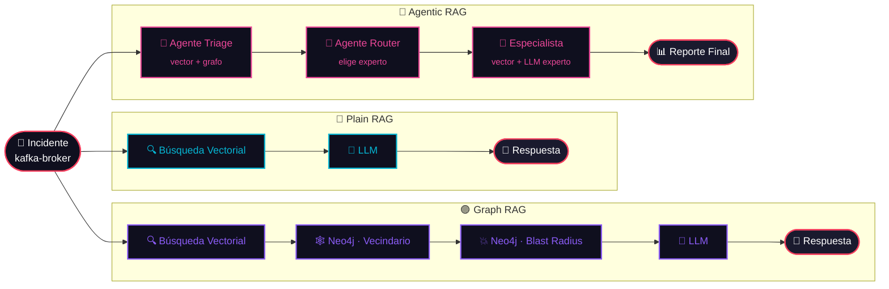

<!-- ════════════════════════════════════════════════════════════════════════ -->
<!--                          ✦   HEADER BANNER   ✦                          -->
<!-- ════════════════════════════════════════════════════════════════════════ -->

<div align="center">


<br/>


<br/><br/>


<br/>

<a href="WORKSHOP.md"></a>

<br/><br/>

<!-- ─── TOC con emojis en una linea ─────────────────────────────────────── -->

[🎬&nbsp;Escenario](#-el-escenario) &nbsp;•&nbsp;
[🗺️&nbsp;Modos](#%EF%B8%8F-los-tres-modos) &nbsp;•&nbsp;
[0️⃣&nbsp;Setup](#0%EF%B8%8F%E2%83%A3-parte-0--configuraci%C3%B3n-5-min) &nbsp;•&nbsp;
[1️⃣&nbsp;Plain&nbsp;RAG](#1%EF%B8%8F%E2%83%A3-parte-1--plain-rag-20-min) &nbsp;•&nbsp;
[2️⃣&nbsp;Graph&nbsp;RAG](#2%EF%B8%8F%E2%83%A3-parte-2--graph-rag-20-min) &nbsp;•&nbsp;
[3️⃣&nbsp;Agentic&nbsp;RAG](#3%EF%B8%8F%E2%83%A3-parte-3--agentic-rag-25-min) &nbsp;•&nbsp;
[4️⃣&nbsp;Explorar](#4%EF%B8%8F%E2%83%A3-parte-4--exploraci%C3%B3n-15-min) &nbsp;•&nbsp;
[🏁&nbsp;Resumen](#-resumen)

</div>

<br/>

<!-- ════════════════════════════════════════════════════════════════════════ -->
<!--                           ✦   EL ESCENARIO   ✦                          -->
<!-- ════════════════════════════════════════════════════════════════════════ -->

<a id="-el-escenario"></a>


<div align="center">

<table>
  <tr>
    <td align="center" width="120">
      
    </td>
    <td>
      <b>📟 PagerDuty acaba de despertarte.</b><br/>
      <code>kafka-broker</code> está devolviendo errores 5xx. El consumer lag crece.<br/>
      Los servicios no logran conectar. <b>Son las 3am. Estás de guardia.</b>
    </td>
  </tr>
</table>

</div>

Tu trabajo: descubrir **qué se rompió**, **qué más está en riesgo** y **qué hacer al respecto**.

Vas a correr el mismo incidente a través de tres modos. En cada uno, el sistema
gana más contexto y toma mejores decisiones. Al final, vas a ver exactamente
dónde termina la *"recuperación"* y dónde comienza lo *"agéntico"*.

<br/>

> [!IMPORTANT]
> **Lleva esta pregunta contigo durante toda la práctica:**
> *¿Qué sabe el sistema ahora que no sabía en el modo anterior — y cómo cambia eso la respuesta?*

<br/>

<!-- ════════════════════════════════════════════════════════════════════════ -->
<!--                          ✦   LOS TRES MODOS   ✦                         -->
<!-- ════════════════════════════════════════════════════════════════════════ -->

<a id="%EF%B8%8F-los-tres-modos"></a>


<div align="center">


</div>

<br/>

<div align="center">

<table>
<tr>
<td align="center" width="33%">


</td>
<td align="center" width="33%">


</td>
<td align="center" width="33%">


</td>
</tr>
</table>

</div>



<br/>

<!-- ════════════════════════════════════════════════════════════════════════ -->
<!--                            ✦   PARTE 0: SETUP   ✦                       -->
<!-- ════════════════════════════════════════════════════════════════════════ -->

<a id="0%EF%B8%8F%E2%83%A3-parte-0--configuraci%C3%B3n-5-min"></a>


Si todavía no lo hiciste:

```bash
make setup    # 🚀 levanta Qdrant + Neo4j, crea .env, instala deps
make seed     # 🌱 carga 20 servicios en Qdrant y Neo4j
```

Verificá que ambos stores tengan datos:

```bash
make inspect-mem    # 🔍 muestra el contenido de Qdrant (debería listar 20 servicios)
make browse-graph   # 🌐 abre el navegador de Neo4j en http://localhost:7474
                    # corré: MATCH (n) RETURN n   para ver la topología
```

> [!TIP]
> **Mientras Neo4j carga**, abrí `src/infrastructure/topology.py`.
> Esta es la **fuente de verdad** — 20 servicios, 5 departamentos, aristas de dependencia.
> Tanto Qdrant (vectorial) como Neo4j (grafo) se siembran desde este mismo archivo.

<br/>

<!-- ════════════════════════════════════════════════════════════════════════ -->
<!--                          ✦   PARTE 1: PLAIN RAG   ✦                     -->
<!-- ════════════════════════════════════════════════════════════════════════ -->

<a id="1%EF%B8%8F%E2%83%A3-parte-1--plain-rag-20-min"></a>


> **Qué hace:** una búsqueda en Qdrant → una llamada al LLM. Nada más.

```bash
make rag kafka-broker
```

Mirá el TUI. Vas a ver exactamente **una llamada `vector`** seguida de **una llamada `llm`**.

<details open>
  <summary><b>👀 Qué observar</b></summary>
  <br/>

- ¿Qué devolvió la búsqueda vectorial? (top resultados por score)
- ¿El LLM sabía qué servicios dependen de `kafka-broker`?
- ¿Mencionó `order-service`, `payment-service`, `notification-service`, `clickhouse-analytics`, `training-pipeline`?
- ¿Qué tan específicos fueron los pasos de mitigación?

</details>

<details>
  <summary><b>💬 Preguntas para discutir</b></summary>
  <br/>

1. Al LLM se le dijo que kafka-broker es un cluster de Kafka. **¿De dónde salió eso?** *(Mirá el resultado vectorial — vino de Qdrant, no de los pesos del LLM.)*

2. El LLM probablemente mencionó *"servicios downstream podrían verse afectados"* en términos vagos. **¿Por qué? ¿Qué información falta?**

3. Si fueras la persona de guardia y recibieras esta respuesta a las 3am, **¿qué seguirías sin saber?**

</details>

<br/>

> [!WARNING]
> **La carencia.** Plain RAG recupera *hechos sobre el servicio* del store vectorial.
> **No** sabe *cómo el servicio se conecta con todo lo demás*.
> La topología está en Neo4j — pero nunca la consultamos.

<br/>

<!-- ════════════════════════════════════════════════════════════════════════ -->
<!--                          ✦   PARTE 2: GRAPH RAG   ✦                     -->
<!-- ════════════════════════════════════════════════════════════════════════ -->

<a id="2%EF%B8%8F%E2%83%A3-parte-2--graph-rag-20-min"></a>


> **Qué agrega:** dos consultas Cypher contra Neo4j *antes* de llamar al LLM.

```bash
make graph-rag kafka-broker
```

Mirá el TUI. Ahora vas a ver:

| Paso | Tool | Descripción |
|:--:|:--|:--|
| 1️⃣ | `vector` | La misma búsqueda en Qdrant que antes |
| 2️⃣ | `graph · vecindario` | Dependencias directas desde Neo4j |
| 3️⃣ | `graph · blast radius` | Recorrido de caminos de longitud variable |

<br/>

<details open>
  <summary><b>👀 Qué cambió respecto a Plain RAG</b></summary>
  <br/>

<div align="center">

| Lo que sabía Plain RAG | Lo que agrega Graph RAG |
|:--|:--|
| Kafka es un servicio data tier-1 | Exactamente **5** servicios dependen de él |
| Kafka maneja mensajería asíncrona | Cascada: `kafka → clickhouse → experiment-tracker` |
| El equipo Kafka es dueño | **3** departamentos (data, product, ml) en el blast radius |

</div>

- ¿Cambió la respuesta del LLM? ¿En qué aspectos?
- ¿El blast radius en la respuesta es **exacto** o sigue siendo estimado?
- ¿Qué consulta Cypher corrió la herramienta de grafo?

</details>

<details>
  <summary><b>🔮 Entendiendo el Cypher</b></summary>
  <br/>

La consulta de blast radius es:

```cypher
MATCH path = (aff:Service)-[:DEPENDS_ON*1..4]->(root:Service {name: $service})
RETURN aff.name, aff.department, [n IN nodes(path) | n.name] AS path_nodes
```

Esto encuentra todo servicio `aff` que tenga un camino dirigido `DEPENDS_ON`
(hasta 4 saltos) que lleve a `kafka-broker`. Si `kafka-broker` falla, todos
esos servicios caen con él.

🧪 Probalo en el navegador de Neo4j:

```cypher
MATCH path = (aff:Service)-[:DEPENDS_ON*1..4]->(root:Service {name: 'kafka-broker'})
RETURN path
```

Deberías ver la cascada visualizada como un grafo. ✨

</details>

<br/>

> [!WARNING]
> **La carencia.** Graph RAG conoce el blast radius **con precisión**. Pero igual le da
> a cada incidente el mismo trato genérico. Una caída de Kafka y una de Postgres reciben
> el mismo system prompt, la misma query de retrieval, el mismo LLM. **No hay especialización.**
>
> *¿Y si pudiéramos enrutar a un experto que conoce los runbooks específicos de Kafka?*

<br/>

<!-- ════════════════════════════════════════════════════════════════════════ -->
<!--                         ✦   PARTE 3: AGENTIC RAG   ✦                    -->
<!-- ════════════════════════════════════════════════════════════════════════ -->

<a id="3%EF%B8%8F%E2%83%A3-parte-3--agentic-rag-25-min"></a>


> **Qué agrega:** el sistema decide *cómo* recuperar, *qué* expertise aplicar
> y *a qué* especialista enrutar — guiado por el contenido del incidente.

```bash
make tui kafka-broker
```

Ahora mirá el pipeline completo desplegarse en tiempo real. 🎥

<br/>

<div align="center">

<table>
  <tr>
    <td align="center" width="33%" valign="top">
      <br/>
      <b>🧠 Agente Triage</b><br/>
      <sub>2 consultas de grafo (vecindario +<br/>blast radius) más una vectorial.<br/>El LLM clasifica <b>servicio · severidad ·<br/>departamento</b> — esa decisión<br/>determina todo lo que sigue.</sub>
    </td>
    <td align="center" width="33%" valign="top">
      <br/>
      <b>🔀 Agente Router</b><br/>
      <sub>Lee los departamentos del<br/><code>blast_radius_report</code> en el estado.<br/>Elige: <b>especialista data</b>.<br/>Marca <code>CROSS-DEPARTMENT</code> si<br/>hay más de uno impactado.</sub>
    </td>
    <td align="center" width="33%" valign="top">
      <br/>
      <b>🎯 Especialista [data]</b><br/>
      <sub>Una <b>segunda</b> búsqueda vectorial<br/>dirigida a conocimiento de data.<br/>Una <b>segunda</b> llamada al LLM con<br/>system prompt: <i>"sos dueño de Kafka,<br/>Postgres, Redis, ClickHouse"</i>.</sub>
    </td>
  </tr>
</table>

</div>

<br/>

<details open>
  <summary><b>📊 Comparar las tres respuestas lado a lado</b></summary>
  <br/>

Corré cada modo para el mismo servicio en pestañas separadas:

```bash
make rag kafka-broker        # 🔵 pestaña 1
make graph-rag kafka-broker  # 🟣 pestaña 2
make tui kafka-broker        # 🌈 pestaña 3
```

<div align="center">

| Pregunta | 🔵 Plain | 🟣 Graph | 🌈 Agentic |
|:--|:--:|:--:|:--:|
| ¿Qué servicios están en riesgo? | Vago | Exacto (5 nombrados) | Exacto + departamentos |
| ¿A quién paginar? | Genérico | Genérico | `data-oncall` específicamente |
| ¿Qué comando Kafka correr? | Improbable | Improbable | Probable (el experto sabe) |
| Llamadas LLM | `1` | `1` | `2` |
| Pasos de retrieval | `1` | `3` | `4–5` |

</div>

</details>

<br/>

> [!NOTE]
> **El momento "agéntico".** La decisión del router **no está hardcodeada**. Lee
> `blast_radius_report.affected_departments` del estado — información que el agente
> de triage recuperó de Neo4j.
>
> El retrieval *informa* el routing, que *determina* qué se recupera después.
>
> 💜 **El retrieval no es un paso fijo. Es una decisión que toma el agente basándose en lo que ya aprendió.**

<br/>

<!-- ════════════════════════════════════════════════════════════════════════ -->
<!--                         ✦   PARTE 4: EXPLORACIÓN   ✦                    -->
<!-- ════════════════════════════════════════════════════════════════════════ -->

<a id="4%EF%B8%8F%E2%83%A3-parte-4--exploraci%C3%B3n-15-min"></a>


<details open>
  <summary><b>🎯 Probá distintos puntos de falla</b></summary>
  <br/>

```bash
make tui api-gateway          # 🏛  platform tier-1 — cascada a casi todo
make tui k8s-controller       # 🛡  infra — cascada a todos los departamentos
make tui experiment-tracker   # 🧪  ml tier-3 — blast radius chico
make tui postgres-primary     # 💾  data — blast radius grande vía product
```

Para cada corrida, **predecí antes de que termine**:

- ¿Qué especialista va a ser llamado?
- ¿Cuántos servicios hay en el blast radius?
- ¿Qué departamentos están afectados?

Después verificá tu predicción en el TUI. 🔮

</details>

<details>
  <summary><b>🗺️ Leé el camino del código para un incidente</b></summary>
  <br/>

Elegí `kafka-broker` y trazá qué pasa:

```
src/infrastructure/mock_apis.py   →  genera el objeto Incident
src/agents/triage.py              →  llama a search_services() + query_service_graph_context()
src/memory/graph.py               →  emite eventos VECTOR_SEARCH, corre la query de Qdrant
src/memory/blast_radius.py        →  emite eventos GRAPH_BFS, corre la query Cypher
src/agents/router.py              →  lee blast_radius_report del estado, elige el departamento
src/agents/specialists/data.py    →  llama a search_services() de nuevo (query específica del depto)
src/tui/display.py                →  renderiza todo lo que ves en la terminal
```

Cada evento en el TUI corresponde a **exactamente una** de estas llamadas. ✨

</details>

<details>
  <summary><b>✏️ Modificá algo — Fácil: agregar un template de incidente</b></summary>
  <br/>

Abrí `src/infrastructure/mock_apis.py` y agregá a `INCIDENT_TEMPLATES`:

```python
{
    "description": "Consumer group lag superando 100k mensajes en {service}",
    "severity": Severity.HIGH,
    "symptoms": ["consumer_lag", "message_backlog", "processing_delay"],
},
```

Después corré `make tui kafka-broker 8` *(índice 8 = tu nuevo template)*.

</details>

<details>
  <summary><b>🛠️ Modificá algo — Medio: agregar un servicio</b></summary>
  <br/>

**1.** Agregá a `src/infrastructure/topology.py`:

```python
Service(
    name="audit-log",
    department=Department.PLATFORM,
    description="Servicio de log de auditoría inmutable para compliance",
    tier=2,
    region="us-east-1",
    depends_on=["kafka-broker", "postgres-primary"],
    sla_minutes=26.28,
    tags=["audit", "compliance"],
    metadata={"port": 8095, "protocol": "http", "owners": ["platform-team"]},
),
```

**2.** Re-sembrá:

```bash
make seed
```

**3.** Corré:

```bash
make tui audit-log
```

🎉 **Observá:** el blast radius de `kafka-broker` ahora incluye `audit-log`. La
consulta de grafo lo descubre automáticamente — *no tocaste código de agentes*.

</details>

<br/>

<!-- ════════════════════════════════════════════════════════════════════════ -->
<!--                              ✦   RESUMEN   ✦                            -->
<!-- ════════════════════════════════════════════════════════════════════════ -->

<a id="-resumen"></a>


<div align="center">

<table>
  <tr>
    <th>Concepto</th>
    <th>Dónde vive</th>
  </tr>
  <tr>
    <td>🔵 Store vectorial (Qdrant)</td>
    <td><code>src/memory/graph.py</code> → <code>search_services()</code></td>
  </tr>
  <tr>
    <td>🟣 Grafo de conocimiento (Neo4j)</td>
    <td><code>src/memory/graph.py</code> → <code>query_service_graph_context()</code></td>
  </tr>
  <tr>
    <td>🕸️ Recorrido de grafo (Cypher)</td>
    <td><code>src/memory/blast_radius.py</code> → <code>_cypher_blast_radius()</code></td>
  </tr>
  <tr>
    <td>📦 Estado del agente</td>
    <td><code>src/agents/state.py</code> → <code>TriageState</code></td>
  </tr>
  <tr>
    <td>🔀 Decisión de routing</td>
    <td><code>src/agents/router.py</code> → lee blast radius del estado</td>
  </tr>
  <tr>
    <td>🎯 Despacho a especialistas</td>
    <td><code>src/agents/specialist_coordinator.py</code></td>
  </tr>
  <tr>
    <td>🎨 Eventos del TUI en vivo</td>
    <td><code>src/tui/events.py</code> → <code>emit()</code> en cada paso</td>
  </tr>
</table>

</div>

<br/>

### 💡 La respuesta en una línea

<div align="center">

<table>
  <tr>
    <td align="center" width="33%">
      🔵 <b>Plain RAG</b><br/>
      <sub>recupera <b>hechos</b></sub>
    </td>
    <td align="center" width="33%">
      🟣 <b>Graph RAG</b><br/>
      <sub>recupera hechos <b>+ relaciones</b></sub>
    </td>
    <td align="center" width="33%">
      🌈 <b>Agentic RAG</b><br/>
      <sub>decide <b>qué · de dónde · quién actúa</b></sub>
    </td>
  </tr>
</table>

</div>

<br/>

<!-- ════════════════════════════════════════════════════════════════════════ -->
<!--                       ✦   DESAFÍOS ADICIONALES   ✦                      -->
<!-- ════════════════════════════════════════════════════════════════════════ -->

<a id="-desaf%C3%ADos-adicionales"></a>


> *Si terminaste rápido o querés seguir después del taller.*

<details>
  <summary><b>🔁 1. Reflexionar y volver a recuperar</b></summary>
  <br/>

Después de que el especialista genere su análisis, agregá un **paso de reflexión**
que verifique la confianza y vuelva a correr la búsqueda vectorial con una query
más específica si el análisis parece superficial.

</details>

<details>
  <summary><b>🌐 2. Incidente cross-departamento — fan out</b></summary>
  <br/>

Disparado un fallo de `k8s-controller`. El router lo marca como `CROSS-DEPARTMENT`.
¿Y si quisieras llamar a **todos los especialistas afectados en paralelo**?

> 💡 **Pista:** [`langgraph.graph.Send`](https://langchain-ai.github.io/langgraph/concepts/low_level/#send)

</details>

<details>
  <summary><b>🧠 3. Memoria entre incidentes</b></summary>
  <br/>

Después de cada triage, escribí el análisis del especialista de vuelta en Qdrant
etiquetado con el nombre del servicio. En el próximo incidente del mismo servicio,
el triage lo recupera como **contexto previo**. ¿Mejora la respuesta?

</details>

<details>
  <summary><b>🎲 4. Reemplazar Cypher por razonamiento del LLM</b></summary>
  <br/>

En `blast_radius.py`, comentá `_cypher_blast_radius()` y reemplazalo por un
LLM que razone sobre fallos en cascada **a partir del contexto vectorial solo**.
Comparalo con la verdad de Cypher en términos de precisión.

</details>

<br/>

<!-- ════════════════════════════════════════════════════════════════════════ -->
<!--                            ✦   FOOTER   ✦                               -->
<!-- ════════════════════════════════════════════════════════════════════════ -->

<div align="center">

<br/>

### 🎉 ¡Lo lograste!

Si te hizo *click*, **dejá una ⭐ en el repo** y compartí lo que construiste.

<br/>

<a href="README.md"></a>
<a href="WORKSHOP.md"></a>
<a href="https://github.com/martin76ec/agentic-rag-workshop/stargazers"></a>

<br/>


<sub>Hecho con 💜 &nbsp;•&nbsp; Workshop v1.0.0 &nbsp;•&nbsp; <a href="#-el-escenario">Arriba ↑</a></sub>

</div>
