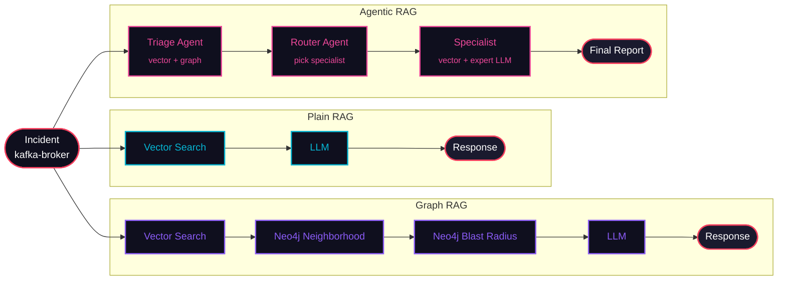

<!-- ════════════════════════════════════════════════════════════════════════ -->
<!--                          ✦   HEADER BANNER   ✦                          -->
<!-- ════════════════════════════════════════════════════════════════════════ -->

<div align="center">


<br/>


<br/><br/>


<br/>

<a href="WORKSHOP.es.md"></a>

<br/><br/>

<!-- ─── one-line emoji TOC ──────────────────────────────────────────────── -->

[🎬&nbsp;Scenario](#-the-scenario) &nbsp;•&nbsp;
[🗺️&nbsp;Modes](#%EF%B8%8F-the-three-modes) &nbsp;•&nbsp;
[0️⃣&nbsp;Setup](#0%EF%B8%8F%E2%83%A3-part-0--setup-5-min) &nbsp;•&nbsp;
[1️⃣&nbsp;Plain&nbsp;RAG](#1%EF%B8%8F%E2%83%A3-part-1--plain-rag-20-min) &nbsp;•&nbsp;
[2️⃣&nbsp;Graph&nbsp;RAG](#2%EF%B8%8F%E2%83%A3-part-2--graph-rag-20-min) &nbsp;•&nbsp;
[3️⃣&nbsp;Agentic&nbsp;RAG](#3%EF%B8%8F%E2%83%A3-part-3--agentic-rag-25-min) &nbsp;•&nbsp;
[4️⃣&nbsp;Explore](#4%EF%B8%8F%E2%83%A3-part-4--exploration-15-min) &nbsp;•&nbsp;
[🏁&nbsp;Recap](#-recap)

</div>

<br/>

<!-- ════════════════════════════════════════════════════════════════════════ -->
<!--                           ✦   THE SCENARIO   ✦                          -->
<!-- ════════════════════════════════════════════════════════════════════════ -->

<a id="-the-scenario"></a>


<div align="center">

<table>
  <tr>
    <td align="center" width="120">
      
    </td>
    <td>
      <b>📟 PagerDuty just woke you up.</b><br/>
      <code>kafka-broker</code> is returning 5xx errors. Consumer lag is growing.<br/>
      Services are failing to connect. <b>It's 3am. You're on-call.</b>
    </td>
  </tr>
</table>

</div>

Your job: figure out **what broke**, **what else is at risk**, and **what to do about it**.

You'll run this same incident through three modes. Each time, the system gets
more context and makes better decisions. By the end you'll see exactly where
*"retrieval"* ends and *"agentic"* begins.

<br/>

> [!IMPORTANT]
> **Carry this question through every part:**
> *What does the system know now that it didn't know in the previous mode — and how does that change the response?*

<br/>

<!-- ════════════════════════════════════════════════════════════════════════ -->
<!--                          ✦   THE THREE MODES   ✦                        -->
<!-- ════════════════════════════════════════════════════════════════════════ -->

<a id="%EF%B8%8F-the-three-modes"></a>


<div align="center">


</div>

<br/>

<div align="center">

<table>
<tr>
<td align="center" width="33%">


</td>
<td align="center" width="33%">


</td>
<td align="center" width="33%">


</td>
</tr>
</table>

</div>



<br/>

<!-- ════════════════════════════════════════════════════════════════════════ -->
<!--                            ✦   PART 0: SETUP   ✦                        -->
<!-- ════════════════════════════════════════════════════════════════════════ -->

<a id="0%EF%B8%8F%E2%83%A3-part-0--setup-5-min"></a>


If you haven't already:

```bash
make setup    # start Qdrant + Neo4j, create .env, install deps
make seed     # load 20 services into Qdrant and Neo4j
```

Verify both stores have data:

```bash
make inspect-mem    # shows Qdrant contents (should list 20 services)
make browse-graph   # opens Neo4j browser at http://localhost:7474
                    # run: MATCH (n) RETURN n   to see the topology
```

> [!TIP]
> **While Neo4j is loading**, open `src/infrastructure/topology.py`.
> This is the **ground truth** — 20 services, 5 departments, dependency edges.
> Both Qdrant (vector) and Neo4j (graph) are seeded from this same file.

<br/>

<!-- ════════════════════════════════════════════════════════════════════════ -->
<!--                          ✦   PART 1: PLAIN RAG   ✦                      -->
<!-- ════════════════════════════════════════════════════════════════════════ -->

<a id="1%EF%B8%8F%E2%83%A3-part-1--plain-rag-20-min"></a>


> **What it does:** one Qdrant search → one LLM call. Nothing else.

```bash
make rag kafka-broker
```

Watch the TUI. You'll see exactly **one `vector` tool call** followed by **one `llm` call**.

<details open>
  <summary><b>What to observe</b></summary>
  <br/>

- What did the vector search return? (top results by score)
- Did the LLM know which services depend on `kafka-broker`?
- Did it mention `order-service`, `payment-service`, `notification-service`, `clickhouse-analytics`, `training-pipeline`?
- How specific were the mitigation steps?

</details>

<details>
  <summary><b>Discussion questions</b></summary>
  <br/>

1. The LLM was told kafka-broker is a Kafka cluster. **Where did that come from?** *(Check the vector result — it came from Qdrant, not the LLM's weights.)*

2. The LLM probably mentioned *"downstream services might be affected"* in vague terms. **Why? What information is missing?**

3. If you were on-call and received this response at 3am, **what would you still not know?**

</details>

<br/>

> [!WARNING]
> **The gap.** Plain RAG retrieves *facts about the service* from the vector store.
> It does **not** know *how the service connects to everything else*.
> The topology is in Neo4j — but we never queried it.

<br/>

<!-- ════════════════════════════════════════════════════════════════════════ -->
<!--                          ✦   PART 2: GRAPH RAG   ✦                      -->
<!-- ════════════════════════════════════════════════════════════════════════ -->

<a id="2%EF%B8%8F%E2%83%A3-part-2--graph-rag-20-min"></a>


> **What it adds:** two Cypher queries against Neo4j *before* calling the LLM.

```bash
make graph-rag kafka-broker
```

Watch the TUI. Now you'll see:

| Step | Tool | Description |
|:--:|:--|:--|
| 1 | `vector` | Same Qdrant search as before |
| 2 | `graph · neighborhood` | Direct deps/dependents from Neo4j |
| 3 | `graph · blast radius` | Variable-length path traversal |

<br/>

<details open>
  <summary><b>What changed vs. Plain RAG</b></summary>
  <br/>

<div align="center">

| What Plain RAG knew | What Graph RAG adds |
|:--|:--|
| Kafka is a tier-1 data service | Exactly **5** services depend on it |
| Kafka handles async messaging | Cascade path: `kafka → clickhouse → experiment-tracker` |
| Kafka team owns it | **3** departments (data, product, ml) in the blast radius |

</div>

- Did the LLM response change? In what ways?
- Is the blast radius in the response **exact** or still estimated?
- What Cypher query did the graph tool run?

</details>

<details>
  <summary><b>Understanding the Cypher</b></summary>
  <br/>

The blast radius query is:

```cypher
MATCH path = (aff:Service)-[:DEPENDS_ON*1..4]->(root:Service {name: $service})
RETURN aff.name, aff.department, [n IN nodes(path) | n.name] AS path_nodes
```

This finds every service `aff` that has a directed `DEPENDS_ON` path
(up to 4 hops) leading to `kafka-broker`. If `kafka-broker` fails, all of
those services fail with it.

Try it in Neo4j browser:

```cypher
MATCH path = (aff:Service)-[:DEPENDS_ON*1..4]->(root:Service {name: 'kafka-broker'})
RETURN path
```

You should see the cascade visualised as a graph.

</details>

<br/>

> [!WARNING]
> **The gap.** Graph RAG knows the blast radius **precisely**. But it still gives every incident
> the same generic treatment. A Kafka outage and a Postgres outage get the same system prompt,
> the same retrieval query, the same LLM. **There's no specialisation.**
>
> *What if we could route to an expert who knows Kafka-specific runbooks?*

<br/>

<!-- ════════════════════════════════════════════════════════════════════════ -->
<!--                         ✦   PART 3: AGENTIC RAG   ✦                     -->
<!-- ════════════════════════════════════════════════════════════════════════ -->

<a id="3%EF%B8%8F%E2%83%A3-part-3--agentic-rag-25-min"></a>


> **What it adds:** the system decides *how* to retrieve, *what* expertise to apply,
> and *which specialist* to route to — driven by the incident content.

```bash
make tui kafka-broker
```

Now watch the full pipeline unfold in real time.

<br/>

<div align="center">

<table>
  <tr>
    <td align="center" width="33%" valign="top">
      <br/>
      <b>Triage Agent</b><br/>
      <sub>2 graph queries (neighborhood +<br/>blast radius) plus a vector search.<br/>LLM classifies <b>service · severity ·<br/>department</b> — this decision drives<br/>everything that follows.</sub>
    </td>
    <td align="center" width="33%" valign="top">
      <br/>
      <b>Router Agent</b><br/>
      <sub>Reads <code>blast_radius_report</code><br/>departments from state.<br/>Picks: <b>data specialist</b>.<br/>Flags <code>CROSS-DEPARTMENT</code> if<br/>more than one is impacted.</sub>
    </td>
    <td align="center" width="33%" valign="top">
      <br/>
      <b>Specialist [data]</b><br/>
      <sub>A <b>second</b> vector search,<br/>targeted at data-specific knowledge.<br/>A <b>second</b> LLM call with a<br/>system prompt: <i>"you own Kafka,<br/>Postgres, Redis, ClickHouse"</i>.</sub>
    </td>
  </tr>
</table>

</div>

<br/>

<details open>
  <summary><b>Compare the three responses side by side</b></summary>
  <br/>

Run each mode for the same service in separate terminal tabs:

```bash
make rag kafka-broker        # tab 1
make graph-rag kafka-broker  # tab 2
make tui kafka-broker        # tab 3
```

<div align="center">

| Question | Plain | Graph | Agentic |
|:--|:--:|:--:|:--:|
| Which services are at risk? | Vague | Exact (5 named) | Exact + departments |
| Who should be paged? | Generic | Generic | `data-oncall` specifically |
| What Kafka command to run? | Unlikely | Unlikely | Likely (specialist knows) |
| LLM calls | `1` | `1` | `2` |
| Retrieval steps | `1` | `3` | `4–5` |

</div>

</details>

<br/>

> [!NOTE]
> **The "agentic" moment.** The router's decision is **not hardcoded**. It reads
> `blast_radius_report.affected_departments` from state — information that was
> retrieved from Neo4j by the triage agent.
>
> Retrieval *informs* the routing, which *determines* what gets retrieved next.
>
> **Retrieval is not a fixed step. It's a decision made by the agent based on what it has already learned.**

<br/>

<!-- ════════════════════════════════════════════════════════════════════════ -->
<!--                         ✦   PART 4: EXPLORATION   ✦                     -->
<!-- ════════════════════════════════════════════════════════════════════════ -->

<a id="4%EF%B8%8F%E2%83%A3-part-4--exploration-15-min"></a>


<details open>
  <summary><b>Try different failure points</b></summary>
  <br/>

```bash
make tui api-gateway          # tier-1 platform — cascades to almost everything
make tui k8s-controller       # infra — cascades to all departments
make tui experiment-tracker   # tier-3 ml — small blast radius
make tui postgres-primary     # data — big blast radius through product
```

For each run, **predict before it completes**:

- Which specialist will be called?
- How many services are in the blast radius?
- Which departments are affected?

Then verify your prediction in the TUI.

</details>

<details>
  <summary><b>Read the code path for one incident</b></summary>
  <br/>

Pick `kafka-broker` and trace what happens:

```
src/infrastructure/mock_apis.py   →  generates the Incident object
src/agents/triage.py              →  calls search_services() + query_service_graph_context()
src/memory/graph.py               →  emits VECTOR_SEARCH events, runs Qdrant query
src/memory/blast_radius.py        →  emits GRAPH_BFS events, runs Cypher query
src/agents/router.py              →  reads blast_radius_report from state, picks department
src/agents/specialists/data.py    →  calls search_services() again (dept-specific query)
src/tui/display.py                →  renders everything you see in the terminal
```

Every event shown in the TUI corresponds to **exactly one** of these calls.

</details>

<details>
  <summary><b>Modify something — Easy: add an incident template</b></summary>
  <br/>

Open `src/infrastructure/mock_apis.py` and add to `INCIDENT_TEMPLATES`:

```python
{
    "description": "Consumer group lag exceeding 100k messages on {service}",
    "severity": Severity.HIGH,
    "symptoms": ["consumer_lag", "message_backlog", "processing_delay"],
},
```

Then run `make tui kafka-broker 8` *(index 8 = your new template)*.

</details>

<details>
  <summary><b>Modify something — Medium: add a service</b></summary>
  <br/>

**1.** Add to `src/infrastructure/topology.py`:

```python
Service(
    name="audit-log",
    department=Department.PLATFORM,
    description="Immutable audit log service for compliance",
    tier=2,
    region="us-east-1",
    depends_on=["kafka-broker", "postgres-primary"],
    sla_minutes=26.28,
    tags=["audit", "compliance"],
    metadata={"port": 8095, "protocol": "http", "owners": ["platform-team"]},
),
```

**2.** Re-seed:

```bash
make seed
```

**3.** Run:

```bash
make tui audit-log
```

**Observe:** the blast radius of `kafka-broker` now includes `audit-log`. The
graph query discovers it automatically — *you didn't change any agent code*.

</details>

<br/>

<!-- ════════════════════════════════════════════════════════════════════════ -->
<!--                              ✦   RECAP   ✦                              -->
<!-- ════════════════════════════════════════════════════════════════════════ -->

<a id="-recap"></a>


<div align="center">

<table>
  <tr>
    <th>Concept</th>
    <th>Where it lives</th>
  </tr>
  <tr>
    <td>Vector store (Qdrant)</td>
    <td><code>src/memory/graph.py</code> → <code>search_services()</code></td>
  </tr>
  <tr>
    <td>Knowledge graph (Neo4j)</td>
    <td><code>src/memory/graph.py</code> → <code>query_service_graph_context()</code></td>
  </tr>
  <tr>
    <td>Graph traversal (Cypher)</td>
    <td><code>src/memory/blast_radius.py</code> → <code>_cypher_blast_radius()</code></td>
  </tr>
  <tr>
    <td>Agent state</td>
    <td><code>src/agents/state.py</code> → <code>TriageState</code></td>
  </tr>
  <tr>
    <td>Routing decision</td>
    <td><code>src/agents/router.py</code> → reads blast radius from state</td>
  </tr>
  <tr>
    <td>Specialist dispatch</td>
    <td><code>src/agents/specialist_coordinator.py</code></td>
  </tr>
  <tr>
    <td>Live TUI events</td>
    <td><code>src/tui/events.py</code> → <code>emit()</code> at every step</td>
  </tr>
</table>

</div>

<br/>

### The one-line answer

<div align="center">

<table>
  <tr>
    <td align="center" width="33%">
      <b>Plain RAG</b><br/>
      <sub>retrieves <b>facts</b></sub>
    </td>
    <td align="center" width="33%">
      <b>Graph RAG</b><br/>
      <sub>retrieves facts <b>+ relationships</b></sub>
    </td>
    <td align="center" width="33%">
      <b>Agentic RAG</b><br/>
      <sub>decides <b>what · from where · who acts</b></sub>
    </td>
  </tr>
</table>

</div>

<br/>

<!-- ════════════════════════════════════════════════════════════════════════ -->
<!--                       ✦   FURTHER CHALLENGES   ✦                        -->
<!-- ════════════════════════════════════════════════════════════════════════ -->

<a id="-further-challenges"></a>


> *If you finish early or want to keep going after the workshop ends.*

<details>
  <summary><b>1. Reflect and re-retrieve</b></summary>
  <br/>

After the specialist generates its analysis, add a **reflection step** that
checks confidence and re-runs the vector search with a more specific query
if the analysis seems shallow.

</details>

<details>
  <summary><b>2. Cross-department incident — fan out</b></summary>
  <br/>

Trigger a `k8s-controller` failure. The router flags it as `CROSS-DEPARTMENT`.
What if you wanted to call **all affected department specialists in parallel**?

> **Hint:** [`langgraph.graph.Send`](https://langchain-ai.github.io/langgraph/concepts/low_level/#send)

</details>

<details>
  <summary><b>3. Memory across incidents</b></summary>
  <br/>

After each triage, write the specialist analysis back into Qdrant tagged with
the service name. On the next incident for the same service, the triage
retrieves it as **prior context**. Does the response improve?

</details>

<details>
  <summary><b>4. Replace Cypher with LLM reasoning</b></summary>
  <br/>

In `blast_radius.py`, comment out `_cypher_blast_radius()` and replace it with
an LLM that reasons about cascading failures from the **vector context alone**.
Compare accuracy against the Cypher ground truth.

</details>

<br/>

<!-- ════════════════════════════════════════════════════════════════════════ -->
<!--                            ✦   FOOTER   ✦                               -->
<!-- ════════════════════════════════════════════════════════════════════════ -->

<div align="center">

<br/>

### You made it!

If this clicked for you, **drop a star on the repo** and share what you built.

<br/>

<a href="README.md"></a>
<a href="https://github.com/martin76ec/agentic-rag-workshop/stargazers"></a>

<br/>


<sub>Made with &nbsp;•&nbsp; Workshop v1.0.0 &nbsp;•&nbsp; <a href="#-the-scenario">Top</a></sub>

</div>
